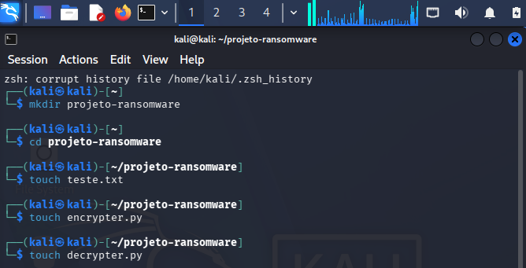
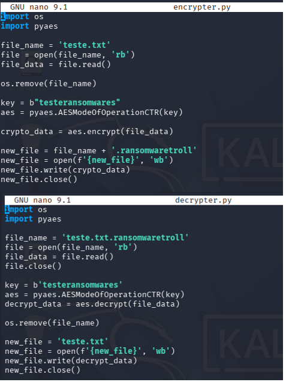
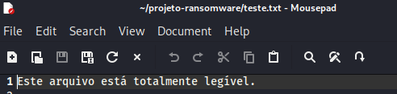
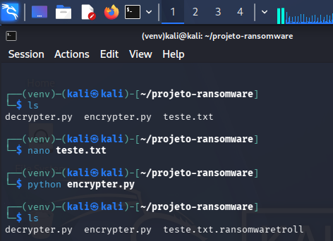
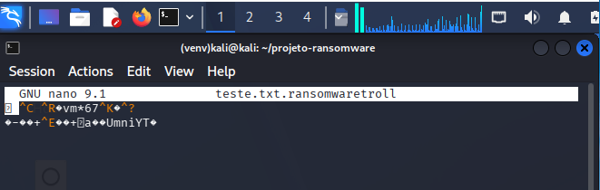
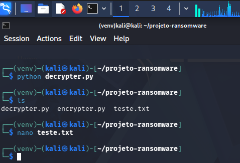
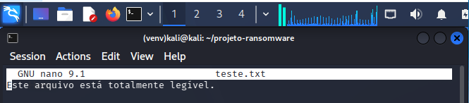

# 📘 Desafio DIO: Implementação de um Ransomware para criptografar arquivos
 ## 🚀  Tecnologias Utilizadas
- Python: `3.13.14`
- Biblioteca: *pyaes*
- Ambiente: `Kali Linux`
- Editor: `Nano`
## 🔐 Criptografia e Descriptografia
### Arquivos do projeto
- **encrypter.py** ➡️ criptografa arquivos usando chave simétrica.  
- **decrypter.py** ➡️ descriptografa arquivos previamente criptografados
- **teste.txt** ➡️ mensagem usada para criptografar e descriptografar
## 🔄 Fluxo de Criptografia e Descriptografia
1. 📂 Criação arquivos teste.txt, encrpyter.py e decrypert.py 
2. 📂 Código encrypter.py ↔️ Código decrypter.py ↔️ Cria teste.txt   
4. 🔐 Executar encrypter.py ↔️ Gera teste.txt.ransomwaretroll 
5. 📂 Arquivos criptografados  
6. 🔓 Executar decrypter.py ↔️ Gera teste.txt  
7. 📂 Arquivos restaurados  
⚠️ **Atenção**: Este projeto não deve ser usado para fins maliciosos. É apenas uma simulação acadêmica.
